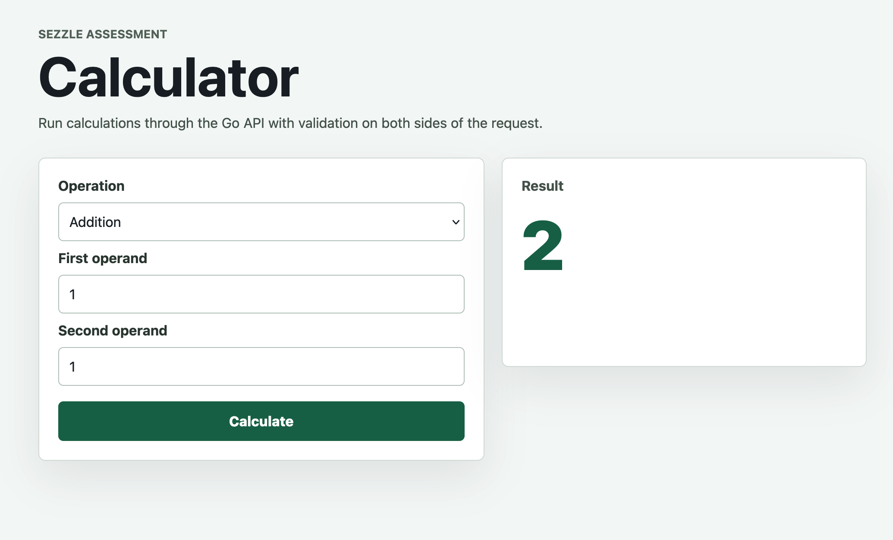

# Sezzle Calculator

Full-stack calculator assessment built with a React + TypeScript frontend and a
Go REST API backend. The frontend calls the backend for all calculations.

## Deliverables

- Frontend code: [`frontend/`](frontend/)
- Backend code: [`backend/`](backend/)
- Setup, run commands, API examples, design decisions, and assumptions: this README
- Unit tests and coverage report: [`docs/coverage.md`](docs/coverage.md)
- Prompts used during development: [`PROMPTS.md`](PROMPTS.md)
- OpenAPI contract: [`docs/openapi.yaml`](docs/openapi.yaml)
- Optional Docker build for frontend + backend together: [`Dockerfile`](Dockerfile)

## Project Overview

The app supports:

- Required operations: addition, subtraction, multiplication, division
- Optional operations: exponentiation, square root, percentage
- Frontend and backend validation
- JSON success and error responses



## Tech Stack

- Frontend: React, TypeScript, Vite, Vitest, React Testing Library
- Backend: Go, standard `net/http`, `httptest`
- Packaging: Docker multi-stage build

## Setup Instructions

Prerequisites:

- Go 1.25+
- Node.js 24+
- npm 11+
- Docker, optional

Install frontend dependencies:

```sh
cd frontend
npm install
```

The backend has no third-party Go dependencies.

## How To Run The Backend

```sh
cd backend
go run ./cmd/server
```

The backend listens on `http://localhost:8080` by default. To use another port:

```sh
HTTP_ADDR=:9090 go run ./cmd/server
```

## How To Run The Frontend

```sh
cd frontend
npm run dev
```

The Vite dev server proxies `/api` and `/healthz` requests to the backend.

## How To Run Tests

Backend:

```sh
cd backend
go test ./... -cover
```

Frontend:

```sh
cd frontend
npm test -- --coverage
npm run build
```

Coverage report: [`docs/coverage.md`](docs/coverage.md)

## Docker

Build:

```sh
docker build -t sezzle-calculator .
```

Run:

```sh
docker run --rm -p 8080:8080 sezzle-calculator
```

Then open `http://localhost:8080`.

## API Examples

API contract: [`docs/openapi.yaml`](docs/openapi.yaml)

Health check:

```sh
curl http://localhost:8080/healthz
```

Calculate:

```sh
curl -X POST http://localhost:8080/api/v1/calculations \
  -H 'Content-Type: application/json' \
  -d '{"operation":"divide","operands":[10,2]}'
```

Success response:

```json
{
  "operation": "divide",
  "operands": [10, 2],
  "result": 5
}
```

Error response:

```json
{
  "error": {
    "code": "DIVISION_BY_ZERO",
    "message": "division by zero"
  }
}
```

Supported operations:

| Operation | Operands | Description |
| --- | ---: | --- |
| `add` | 2 | Adds two numbers |
| `subtract` | 2 | Subtracts the second number from the first |
| `multiply` | 2 | Multiplies two numbers |
| `divide` | 2 | Divides the first number by the second |
| `power` | 2 | Raises the first number to the second |
| `sqrt` | 1 | Returns the square root of one number |
| `percentage` | 1 | Divides one number by 100 |

Stable error codes:

- `INVALID_JSON`
- `INVALID_OPERATION`
- `INVALID_OPERANDS`
- `DIVISION_BY_ZERO`
- `NON_FINITE_RESULT`
- `METHOD_NOT_ALLOWED`
- `NOT_FOUND`
- `INTERNAL_ERROR`

## Design Decisions

- Kept the backend small: HTTP handler, API models, and calculator service.
- Used Go's standard `net/http` package to avoid unnecessary framework weight.
- Kept calculator rules out of HTTP handlers so service logic is easy to test.
- Centralized frontend API calls in `calculatorClient.ts`.
- Used test-first development for service logic, API handlers, API client, and UI behavior.
- Delivered as a monorepo so reviewers can clone one repo and run the full app.
- Added a single Dockerfile so the frontend and backend can run together.

## Assumptions

- `float64` is acceptable for a general calculator.
- This is not financial decimal math.
- Unary operations use one operand; binary operations use two.
- The frontend and backend are developed together for this assessment.
- No persistence is required.
- Authentication, authorization, and rate limiting are out of scope.

## Known Tradeoffs

- A single `POST /api/v1/calculations` endpoint keeps the API compact, but per-operation endpoints could be more explicit.
- The Docker image serves the frontend and backend together for simple review, while a larger production system might deploy them separately.
- Generated coverage artifacts are not committed; the committed coverage report summarizes the latest local run and explains how to regenerate it.
